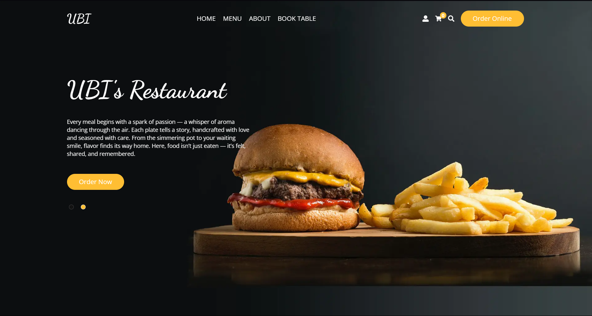
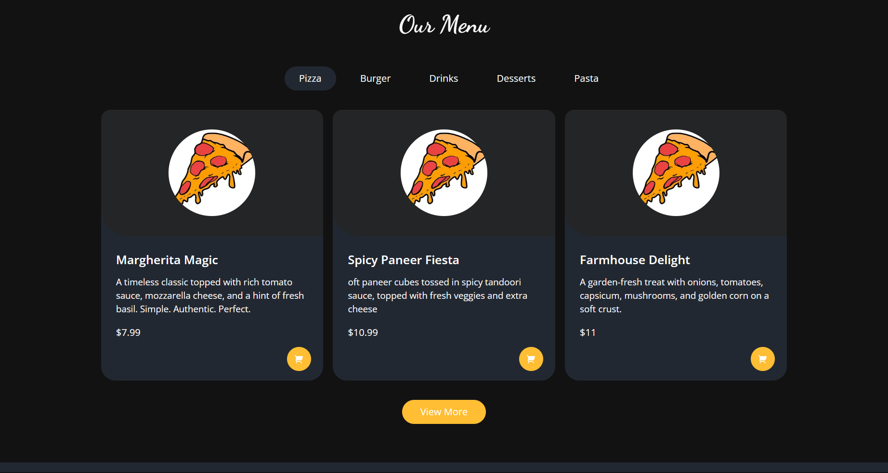
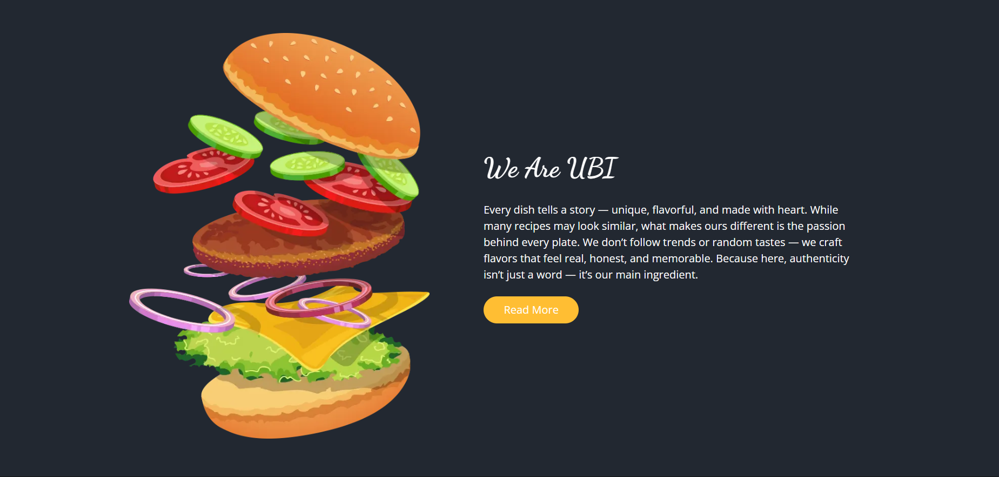
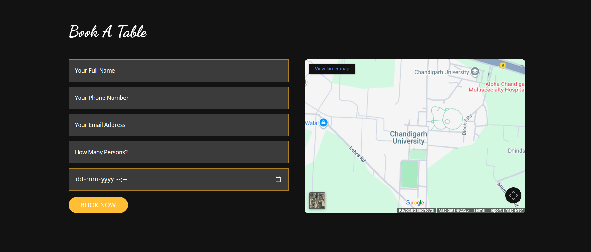
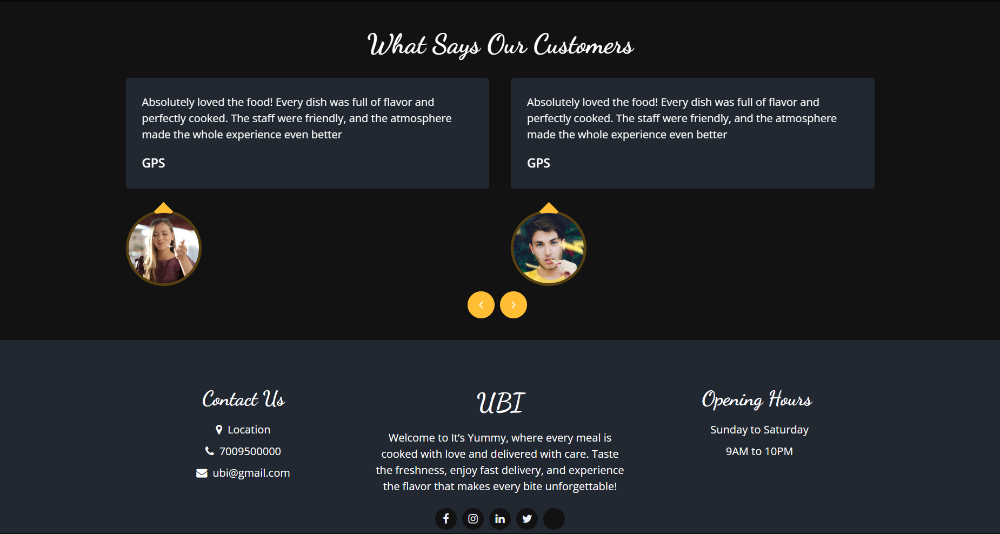
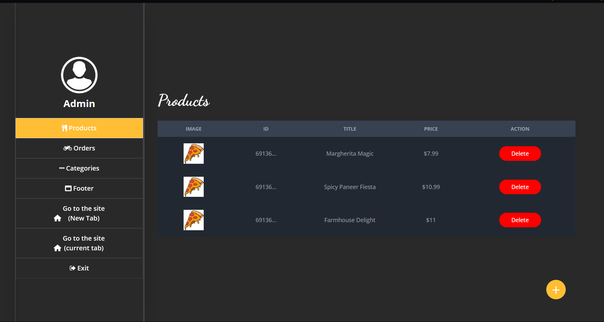
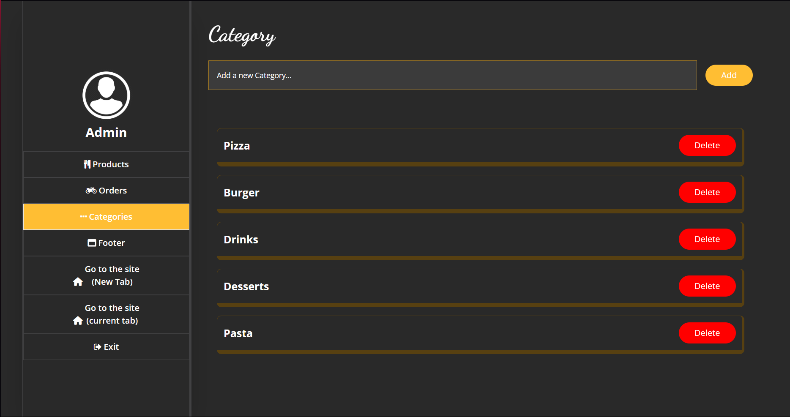

# 🍽️ Capstone Project – Food Restaurant App

A **Full-Stack Food Ordering and Restaurant Management Web Application** built using **Next.js**, **React**, **MongoDB**, and **Tailwind CSS**.  
This project was customized and developed by **Gaganpreet Singh** as part of the Capstone Project.

## 📸 Screenshot Preview

### 🏠 Homepage
<p align="center">
  
</p>

### 🍕 Menu Page
<p align="center">
  
</p>

### 👨‍🍳 About Section
<p align="center">
  
</p>

### 📅 Book A Table
<p align="center">
  
</p>

### 💬 Customer Reviews
<p align="center">
  
</p>

### 🧑‍💻 Admin Panel
#### 🥗 Products
<p align="center">
  
</p>

#### 🍴 Categories
<p align="center">
  
</p>

#### 🧾 Orders
<p align="center">
  
</p>

---

## 🚀 Features

✅ **Responsive Design:** Works seamlessly on mobile, tablet, and desktop  
✅ **Menu Management:** Dynamic food menu with prices and images  
✅ **Online Table Reservation:** Form validation using Formik + Yup  
✅ **Google Maps Integration:** Displays location of Chandigarh University  
✅ **User Authentication (Optional):** For customers and admin panel  
✅ **Modern UI/UX:** Built with TailwindCSS and clean component architecture  
✅ **Real-Time Preview:** Hot reload using Next.js dev server  

---

## 🏗️ Tech Stack

| Layer | Technology |
|-------|-------------|
| Frontend | Next.js (React Framework) |
| Styling | Tailwind CSS |
| Forms | Formik + Yup Validation |
| Database | MongoDB Atlas |
| Icons | React Icons / Lucide |
| Version Control | Git + GitHub |

---

## 🧩 Pages and Components

- `Home Page` – Introduction and featured menu  
- `Menu Page` – Full menu listing  
- `Reservation Page` – Book a table with form validation  
- `Contact Page` – Embedded Google Map (Chandigarh University)  
- `Admin Panel` – Manage menu and orders *(optional)*

---

## 🧠 How to Run the Project Locally

You can run this project on your own computer using **Node.js** and **npm**.

### 🪜 Steps:

1. **Clone this repository**
   ```bash
   git clone https://github.com/Gaganpreet0001/Capstone-Project-Food-Restaurant.git
Navigate to the project folder

bash
Copy code
cd Capstone-Project-Food-Restaurant
Install dependencies

bash
Copy code
npm install
Run the development server

bash
Copy code
npm run dev
Open in your browser

arduino
Copy code
http://localhost:3000
(If port 3000 is in use, the app will automatically run on port 3001.)

💡 Tip:
When you save any changes in VS Code, the browser will automatically reload — no need to restart the server.

🌐 How to Deploy (Run Online)
You can easily deploy this full-stack Next.js project for free using Vercel (recommended) or Netlify.

🚀 Deploy Using Vercel (Recommended)
Go to https://vercel.com

Click “Import Project” → “Import GitHub Repository”

Select your repo:

nginx
Copy code
Gaganpreet0001 / Capstone-Project-Food-Restaurant
Vercel will automatically detect it’s a Next.js project

Click Deploy

After deployment, you’ll get a live link like:

arduino
Copy code
https://capstone-project-food-restaurant.vercel.app
✅ Done!
Your site is now live and accessible from anywhere.

---

